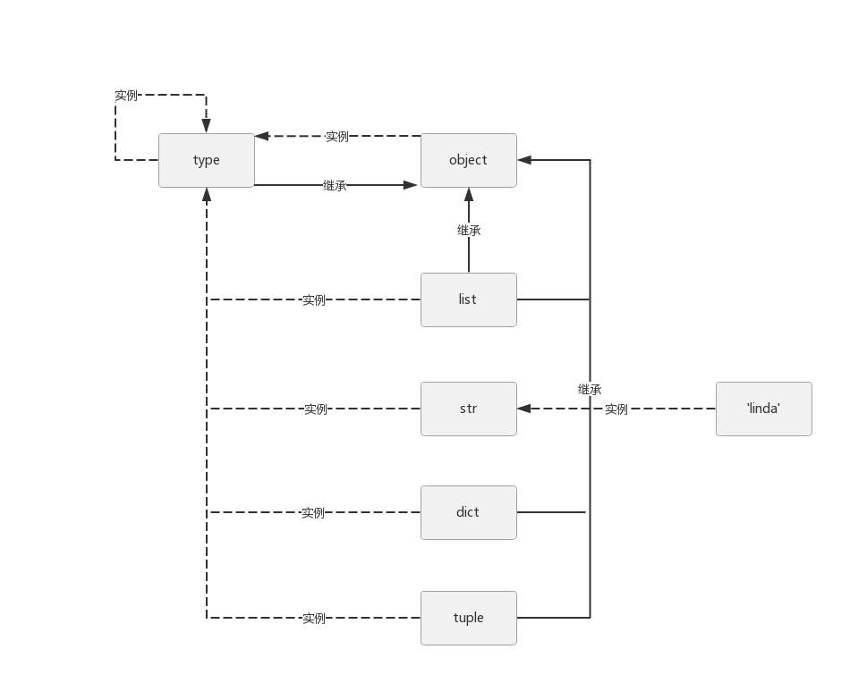

===============================
2.2 type、object和class之间的关系
===============================

--------------------
type 实例化常见类型
--------------------

.. code-block:: py

    >>> name = 'linda'
    >>> type(num)
    <class 'int'>
    >>> type(int)
    <class 'type'>
    >>> type(object)
    <class 'type'>
    >>> type(type)
    <class 'type'>

- 类 str 实例化 'linda'
- 类 type 实例化 str
- 类 type 实例化 object
- 类 type 实例化 type (具体实现 类似C语言指针)

--------------------
object 是最顶层基类
--------------------

.. code-block:: py

    >>> int.__bases__
    (<class 'object'>, )
    >>> type.__bases__
    (<class 'object'>, )
    >>> object.__bases__
    ()

- 类 str 继承 object
- 类 type 继承 object
- object.__bases__ 值为 ()

--------------------
type、object、class关系图
--------------------

- 把 list，dict 等类做成对象，后续后修改特别方便
- object 是所有类的基类，type 也要继承它
- type 也是自身的实例，一切皆对象，一切继承object
