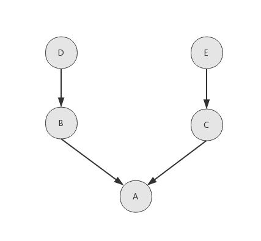
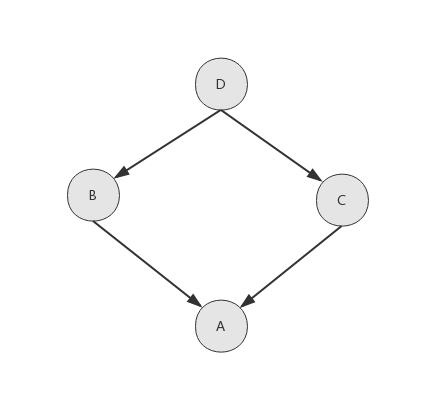

===============================
4.5 类属性和实例属性以及查找顺序
===============================

--------------------
类属性和实例属性
--------------------

- 类属性：定义在类中的变量和方法
- 实例属性：__init__中定义

--------------------
深度优先 DFS
--------------------

- 查找顺序为 A -> B -> D -> C -> E
- 此种场景深度优先较为合适

- 查找顺序为 A -> B -> D -> C
- 此种场景 当C中重载了D中某个方法，该查找顺序就不合适

--------------------
广度优先 BFS
--------------------

- 查找顺序为 A -> B -> C -> D
- 此种场景深度优先较为合适

- 查找顺序为 A -> B -> C -> D -> E
- 此种场景 B继承D，B和D是一体的，D应该先于C

--------------------
MRO C3 算法
--------------------

菱形功能继承D场景

.. code-block:: py

    class D:
    pass

    class C(D):
    pass

    class B(D):
    pass

    class A(B, C):
    pass

    print(A.__mro__)
    # (<class '__main__.A'>, <class '__main__.B'>, <class '__main__.C'>, <class '__main__.D'>, <class 'object'>)

B、C 各自继承D、E场景

.. code-block:: py

    class D:
        pass

    class E:
        pass

    class C(E):
        pass

    class B(D):
        pass

    class A(B, C):
        pass

    print(A.__mro__)
    # (<class '__main__.A'>, <class '__main__.B'>, <class '__main__.D'>, <class '__main__.C'>, <class '__main__.E'>, <class 'object'>)
