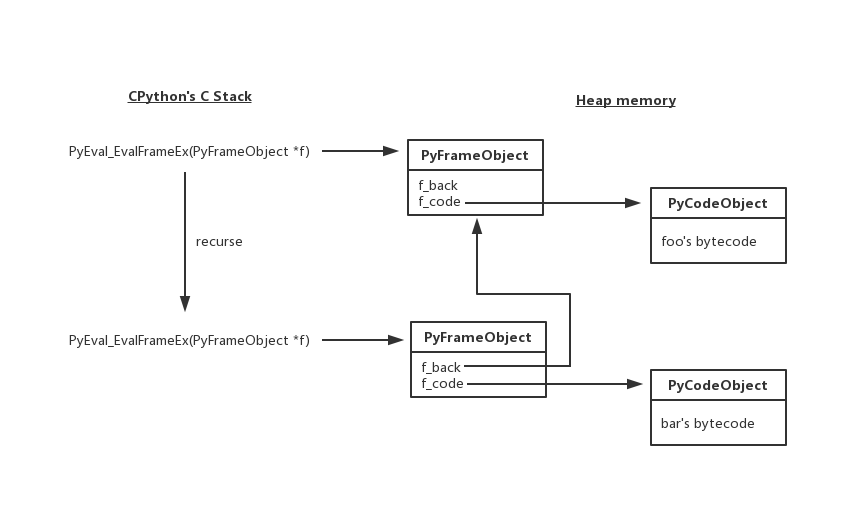
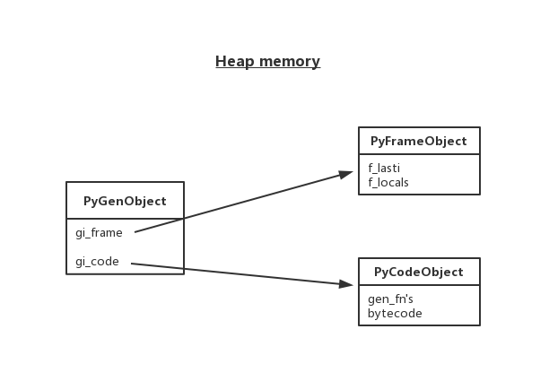

===============================
9.4 python是如何实现生成器的
===============================

- 什么场景下运用生成器
- 生成器内部实现原理
- 生成器函数与普通函数区别

-------------------------------
python中函数工作原理
-------------------------------
python.exe会用一个叫做PyEval_EvalFrameEx(c函数)去执行foo函数 首先会创建一个栈帧(stack_frame)，一个上下文

.. code-block:: py

    import inspect
    frame = None

    def foo():
    bar()

    def bar():
    global frame
    frame = inspect.currentframe()

    # 查看函数实现原理
    # import dis
    # print(dis.dis(foo))

    foo()
    print(frame.f_code.co_name)         # 函数名 bar

    caller_frame = frame.f_back
    print(caller_frame.f_code.co_name)  # 函数名 foo

python中一切皆对象，栈帧对象中运行foo函数字节码对象
当foo调用子函数bar，又会创建一个栈帧对象，在此栈帧对象中运行bar函数字节码对象

所有的栈帧都是分配再堆内存上(不会自动释放)，这就对定了栈帧可以独立于调用者存在;不用于静态语言的调用，静态语言是栈的形式，调用完就自动释放

-------------------------------
python中生成器函数工作原理
-------------------------------

.. code-block:: py

    def gen_func():
        address = 'China'
        yield 1
        name = 'linda'
        yield 2
        age = 20
        return 'done'

    gen = gen_func()

    import dis
    print(dis.dis(gen))

    print(gen.gi_frame.f_lasti)
    print(gen.gi_frame.f_locals)

    print('\nfirst value: %s' % next(gen))
    print(gen.gi_frame.f_lasti)
    print(gen.gi_frame.f_locals)

    print('\nsecond value: %s' % next(gen))
    print(gen.gi_frame.f_lasti)
    print(gen.gi_frame.f_locals)

- 控制整个生成器函数暂定和继续前进 gen.gi_frame.f_lasti
- 整个生成器函数作用域逐渐变化 gen.gi_frame.f_locals
